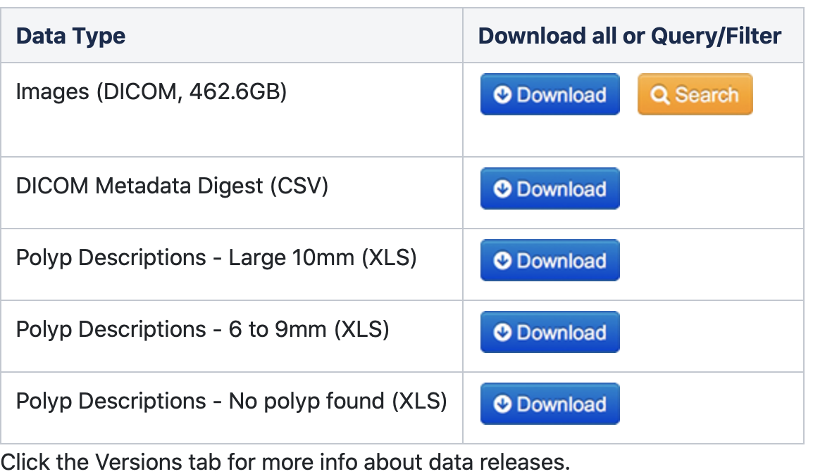
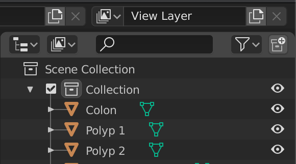

# VR-Caps
A Virtual Environment for Active Capsule Endoscopy

<p align="center">
 
</p>

## Overview

We introduce a virtual active capsule endoscopy environment developed in Unity that provides a simulation platform to generate synthetic data as well as a test bed to develop and test algorithms. Using that envronment, we perform various evaluations for common robotics and computer vision tasks of active capsule endoscopy such as classification, pose and depth estimation, area coverage, autonomous navigation, learning control of endoscopic capsule robot with magnetic field inside GI-tract organs, super-resolution, etc. The demonstration of our virtual environment is available on [YouTube](https://www.youtube.com/watch?v=UQ2u3CIUciA).

Our main contributions are as follows:
  - We propose synthetic data generating tool for creating fully labeled data.
  - Using our simulation environment, we provide a platform for testing numerous highly realistic scenarios.
  
See [Summary of our work](Summary.md) for details and our [Paper](..).


## Getting Started

### 1. Installation

The VR-Caps contains several components:
  - Unity
  - ML-Agents
  - SOFA
  - MagnetoDynamics
  - SC-SfMLearner
  
Consequently, to install and use the VR-Caps you will need to:

  - [Download](https://unity3d.com/get-unity/download) and Install Unity(2018.4 or later)
  - [Install](https://www.python.org/downloads/) Python(3.6.1 or higher)
  - [Install](https://github.com/Unity-Technologies/ml-agents) ML-Agents(Release 1 or higher)
  - [Install](http://infinytech3d.com/SofaUnity/sofaUnity.php) SofaAPAPI-Unity3D

#### Clone the VR-Caps Repository

Now that you have installed Unity and Python, you can now clone this repository

```sh
git clone https://github.com/CapsuleEndoscope/VirtualCapsuleEndoscopy.git
```
Now, you will need open Unity Hub and simply create a new Unity project by adding VR-Caps-Unity. Then, simply open the Unity by clicking on the project you just added.

The opening scene Clinic Setup is our default scene. You can navigate other scenes by [Scenes](VR-Caps-Unity/Assets/Scenes).

### 2. Creating Synthetic Data

For data creation tool, please open Record Collect scene from [Scenes](VR-Caps-Unity/Assets/Scenes).

This will open a scene where there is one of our GI system models is already placed and a capsule with a camera and a light source is attached on it.
<p align="center">
  
</p>

You will need **Unity Recorder** which can be installed using **Unity Package Manager** (see [image](img/Unity-Recorder.png)
<p align="center">
  
</p>


#### Importing new models to the scene

You can import other models from [GI-Organs](Assets/GI-Organs) folder by simply dragging the model to the scene. You will notice that the imported model has no texture. 

In order to add texture, you need to navigate [Organs](VR-Caps-Unity/Assets/Imported/Materials/Organs) folder and simply drag material files (.mat) to corresponding 3D organs (For example, Colon Material.mat to Colon that can be selected in the Hierarchy window under the Prefab.)
<p align="left">
  
</p>

#### Generating 3D organs from scratch

One can also generate 3D organs from different patients using the publicly available [Cancer Imaging Archive](https://www.cancerimagingarchive.net/collections/). Please select a CT data in the DICOM format among the dataset for colon or stomach (see below [image](img/OrganDataset.png)). Please note that the DICOM images consist of two sets, one taken in the supine position and the other in the prone position. The supine position DICOM images were used since that is the patient’s position during the capsule endoscopy session

<p align="center">
 
</p>

After downlading DICOM data, use [InVesalius](https://invesalius.github.io) or any similar softwarer to convert the DICOM images to 3D objects. The software provides an automatic selection of the regions desired to be converted, which in our case is the Soft Tissue. Then a surface will be created on the selected regions constructing the corresponding 3D model, which is exported as a Wavefront (.obj) file.

The 3D model is then imported into [Blender](https://www.blender.org) for further processing which includes removal of bones, fat, skin, and other artifacts that the imported model has so that only the geometries of the colon, small intestines and stomach remain. Please note that not all converted 3D models includes the whole colon and intestines, these models should be discarded.

As some models consist of a large number of mesh which makes it hard to process, we reduced the number of mesh by using another software called [MeshLab](https://www.meshlab.net), using an algorithm called Quadric Edge Collapse Decimation for mesh simplification. It reduces the face number of a mesh while preserving its boundaries and normals.

Please note that, due to some imperfections on the CT data, you may need to fill the gaps and fix the topology of the organs. We used Blender for this operation. Please make sure that there is no missing parts in the 3D organs and the connections and the openings between the stomach and small intestines, and the small intestines and colon are all set.


#### Generating Disease Classes

##### Polyps
In the [Cancer Imaging Archive](https://www.cancerimagingarchive.net/collections/), you can also find  have different models of the organs with the cancerous lumps that can be used to real shaped polyps with realistic locations of occurence (see [image](img/PolypData.pn)). Please navigate to relavant class and download the corresponding DICOM format. Then, by following the same steps explained [above](#generating-3D-organs-from-scratch), you can create 3D organ with polyps. In order to attain the texture particularly generated for polyps, you should use Blender or a similar software to manually depart meshes for the regions of polyp occurences and save them as different models.(see below [image](img/polypinblender.png)) 

<p align="center">
 
</p>
<p align="center">
 
</p>

##### Ulcer and Hemorrage


## Tasks 

#### 1. Area Coverage

We use Unity's ML-Agents Toolkit for a Deep Reinforcement Learning (DRL) based active control method that has a goal of learning a maximum coverage policy for human colon monitoring within a minimal operation time.

- [Designing a Learning Environment](Learning-Environment-Design.md)
- [Training ML-Agents](Training-ML-Agents.md)

#### 2. Pose and Depth Estimation

To illustrate the effectiveness of VR-Caps environment in terms of neural network training for pose and depth estimation, we trained a state-of-the-art method, SC-SfMLearner algorithm, using synthetic 
with pose and depth ground truths acquired from VR-Caps environment.

#### 3. 3D Reconstruction

In this work, we propose and evaluate a hybrid 3D reconstruction technique including steps Otsu threshold-based reflection detection, OPENCV inpainting-based reflection suppression, feature matching and tracking based image stitching and non-lambertion surface reconstruction. To exemplify the effectiveness of Unity data, we compare the results of reconstructions both on real and synthetic data. 

#### 4. Disease Classification

We mimic the 3 diseases (i.e., Polyps, Haemorrhage and Ulcerative Collitis) in our simulation environment. Hemorrage and Ulcerative Collitis are created based on the real endoscopy images from Kvasir dataset mimicking the abnormal mucosa texture. As polyps are not only distintive in texture but also in topology, we use CT scans from patients who have polyps and use this 3D morphological information to reconstruct 3D organs inside our environment.  instances with different severities ranging from grade 1 to grade 4, three different grades of ulcerative colitis, and different polyps instances with various shapes and sizes.

<p align="center">
 
</p>

#### 5. Super Resolution

We benchmarked the effectivity of the Unity environment using Deep Super-Resolution for Capsule Endoscopy (EndoL2H) network based on the dilemma of high camera resolution coming with increasing the size of the optics and the sensor array.


## Results

Visual demonstration of all tasks done on this work and their results are as follows: For more details, please visit the article.

<p align="center">
 
</p>

## Frequently Asked Questions

## Limitations

## Reference

If you find our work useful in your research or if you use parts of this code please consider citing our paper:

```
@article{...,
    title={VR-Caps: A Virtual Environment for Active Capsule Endoscopy},
    author={Kagan Incetan and Abdulhamid Obeid and Omer Celik and Guliz Irem Gokceler and Yasin Almalioglu and Hunter B. Gilbert and Nicholas J. Durr and Faisal Mahmood and Kutsev Bengisu Ozyoruk and Mehmet Turan},
    journal={...},
    year={2020}
}
```


<!-- 

## Installation & Set-up

- [Installation](#1-installation)


## Getting Started

- [Creating An Environment](Creating-An-Environment.md)


## Help

- [Frequently Asked Questions](#frequently-asked-questions)
- [Limitations](#limitations)

-->
