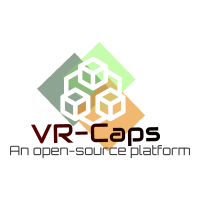
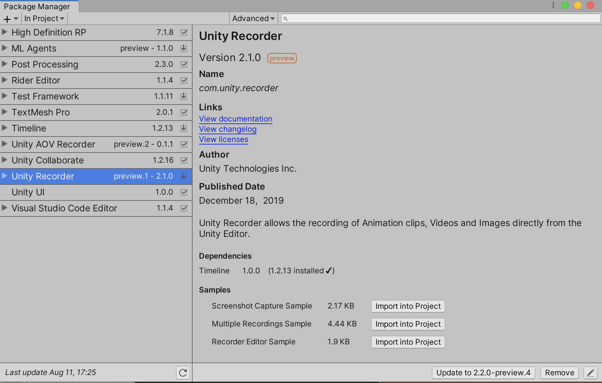
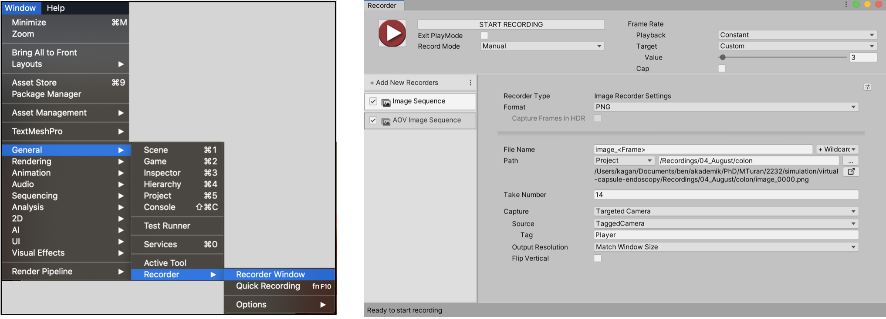
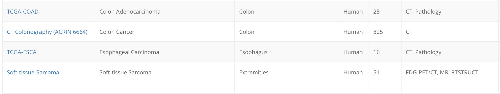
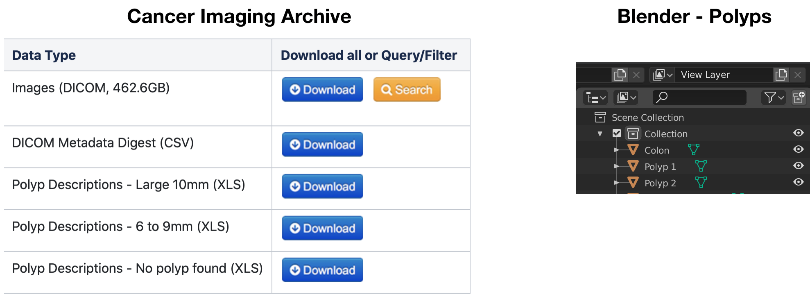
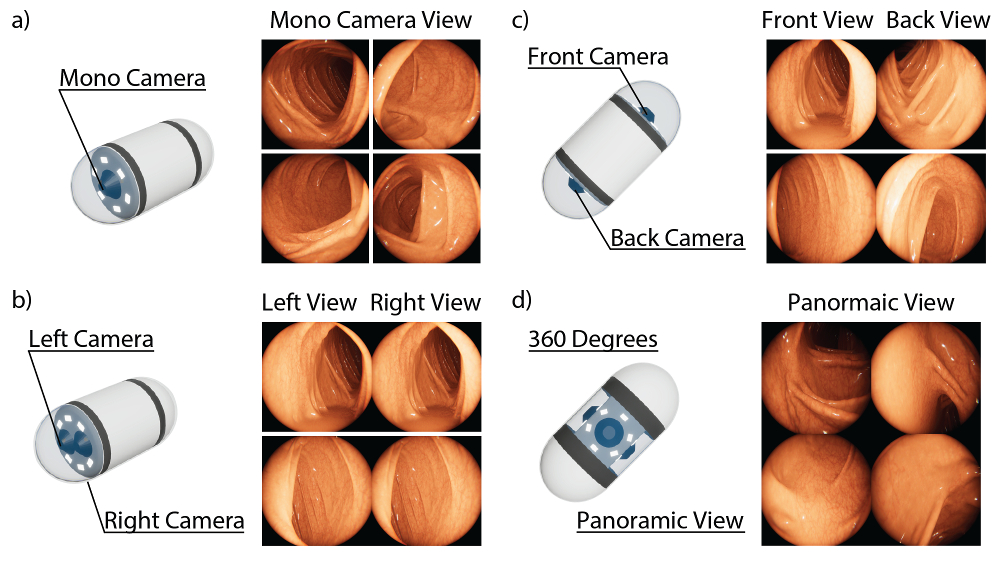
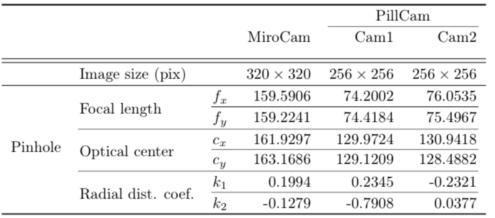
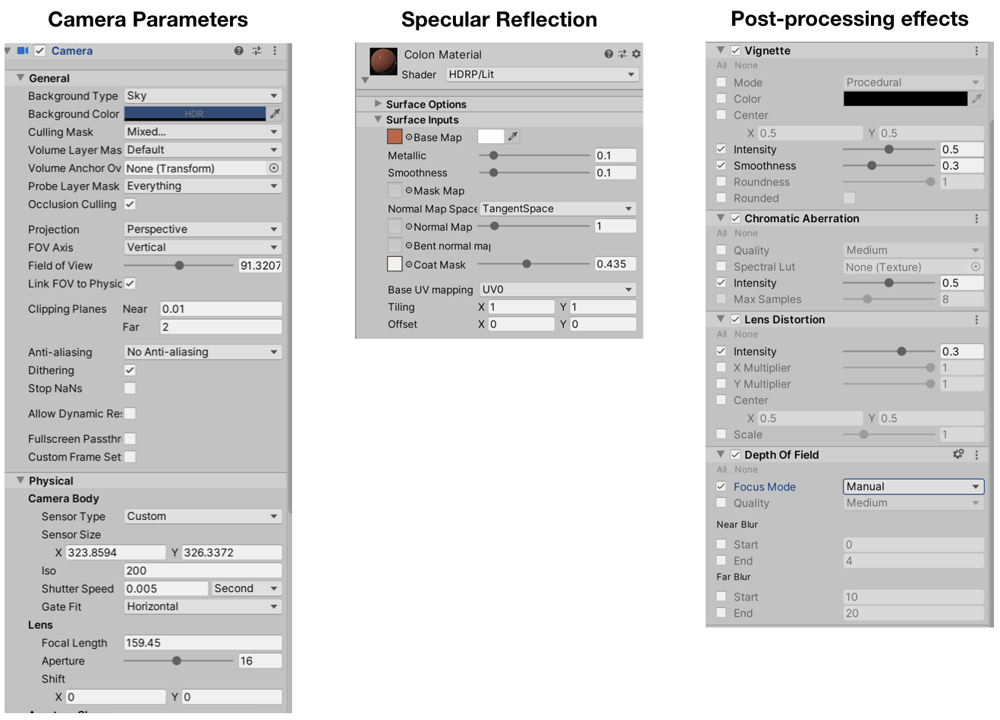

VR-Caps: A Virtual Environment for Capsule Endoscopy
=====
<p align="center">
 
</p>


<p align="center">
 
</p>

## Overview

We introduce a virtual active capsule endoscopy environment developed in Unity that provides a simulation platform to generate synthetic data as well as a test bed to develop and test algorithms. Using that environment, we perform various evaluations for common robotics and computer vision tasks of active capsule endoscopy such as classification, pose and depth estimation, area coverage, autonomous navigation, learning control of endoscopic capsule robot with magnetic field inside GI-tract organs, super-resolution, etc. The demonstration of our virtual environment is available on [YouTube](https://www.youtube.com/watch?v=UQ2u3CIUciA).

Our main contributions are as follows:
  - We propose synthetic data generating tool for creating fully labeled data.
  - Using our simulation environment, we provide a platform for testing numerous highly realistic scenarios.
  
See [Summary of our work](Summary.md) for details and our [Paper](https://arxiv.org/abs/2008.12949).


## Getting Started

### 1. Installation

The VR-Caps contains several components:
  - Unity
  - ML-Agents
  - SOFA
  - MagnetoDynamics
  - SC-SfMLearner
  
Consequently, to install and use the VR-Caps you will need to:

  - [Download](https://unity3d.com/get-unity/download) and Install Unity(2018.4 or later)
  - [Install](https://www.python.org/downloads/) Python(3.6.1 or higher)
  - [Install](https://github.com/Unity-Technologies/ml-agents) ML-Agents(Release 1 or higher)
  - [Install](http://infinytech3d.com/SofaUnity/sofaUnity.php) SofaAPAPI-Unity3D

#### Clone the VR-Caps Repository

Now that you have installed Unity and Python, you can now clone this repository.

```sh
git clone https://github.com/CapsuleEndoscope/VirtualCapsuleEndoscopy.git
```
Now, you will need open Unity Hub and simply create a new Unity project by adding VR-Caps-Unity. Then, simply open the Unity by clicking on the project you just added. Please note that we have tested the environment on Unity Version 2019.3.3f1.

The opening scene Clinic Setup is our default scene. You can navigate other scenes by [Scenes](VR-Caps-Unity/Assets/Scenes).

### 2. Creating Synthetic Data

For data creation tool, please open Record Collect scene from [Scenes](VR-Caps-Unity/Assets/Scenes).

This will open a scene where there is one of our GI system models is already placed and a capsule with a mono camera and a light source is attached on it.
<p align="center">
  
</p>

You will need **Unity Recorder** which can be installed using **Unity Package Manager** (see [image](img/Unity-Recorder.png))
<p align="center">
  
</p>

After installing Unity Recorder, navigate to Recorder Window and open the Recorder panel. 

On the panel, click **Add New Recorders** and then select **Image Sequence** and **AOV Image Sequence** for RGB image recording and depth recording respectively. 

<p align="center">
  
</p>

Adjust image resolutions from **Capture Output Resolution** and FPS(Frame per second) from **Target Value**.

#### Importing new models to the scene

You can import other models from [GI-Organs](https://drive.google.com/drive/folders/1PJvGr9i3G5oe1t_Qw6mwq2YX3QPmk5-T?usp=sharing) folder by simply dragging the model to the scene. You will notice that the imported model has no texture.

In order to add texture, you need to navigate [Organs](VR-Caps-Unity/Assets/Imported/Materials/Organs) folder and simply drag material files (.mat) to corresponding 3D organs (For example, Colon Material.mat to Colon that can be selected in the Hierarchy window under the Prefab.)

#### Generating 3D organs from scratch

One can also generate 3D organs from different patients using the publicly available [Cancer Imaging Archive](https://www.cancerimagingarchive.net/collections/). Please select a CT data in the DICOM format among the dataset for colon or stomach (see below [image](img/OrganDataset.png)). Please note that the DICOM images consist of two sets, one taken in the supine position and the other in the prone position. The supine position DICOM images were used since that is the patient’s position during the capsule endoscopy session

<p align="center">
 
</p>

After downlading DICOM data, use [InVesalius](https://invesalius.github.io) or any similar softwarer to convert the DICOM images to 3D objects. The software provides an automatic selection of the regions desired to be converted, which in our case is the Soft Tissue. Then a surface will be created on the selected regions constructing the corresponding 3D model, which is exported as a Wavefront (.obj) file.

The 3D model is then imported into [Blender](https://www.blender.org) for further processing which includes removal of bones, fat, skin, and other artifacts that the imported model has so that only the geometries of the colon, small intestines and stomach remain. Please note that not all converted 3D models includes the whole colon and intestines, these models should be discarded.

As some models consist of a large number of mesh which makes it hard to process, we reduced the number of mesh by using another software called [MeshLab](https://www.meshlab.net), using an algorithm called Quadric Edge Collapse Decimation for mesh simplification. It reduces the face number of a mesh while preserving its boundaries and normals.

Please note that, due to some imperfections on the CT data, you may need to fill the gaps and fix the topology of the organs. We used Blender for this operation. Please make sure that there is no missing parts in the 3D organs and the connections and the openings between the stomach and small intestines, and the small intestines and colon are all set.


#### Generating Disease Classes
We create pipeline to mimic 3 classes of diseases in our environment (Polpys with various shapes and sizes, Ulcerative Collitis and Hemorrage for 3 and 4 different amount and severity levels respectively) that can be used to train/test disease classification algorithms.

##### Polyps
In the [Cancer Imaging Archive](https://www.cancerimagingarchive.net/collections/), you can also find different models of the organs with the cancerous lumps that can be used to mimic real shaped polyps with realistic locations of occurence. Firts, navigate to relavant class in the archive and download the corresponding DICOM format. Then, by following the same steps explained [above](#generating-3D-organs-from-scratch), you can create 3D organ with polyps. In order to attain the texture particularly generated for polyps, you should use Blender or a similar software to manually depart meshes for the regions of polyp occurences and save them as different models. Then in Unity you can attain polyps texture Polyps.mat in the where other organ textures are located.
<p align="center">
 
</p>

##### Ulcertive Collitis and Hemorrage
Unlike Polyps, Ulcer and Hemorrage do not have differ in the topology of 3D organs but in texture. Therefore, we generate specific textures for these classes. In order to create organs with these diseases, please select and attain a texture from the textures folder where other .mat files exist. 
<p align="center">
 
</p>

#### Various camera designs
As there are commercially available options in capsule camera designs in the wireless capsule endoscopy, in our environment, we extend the standard mono camera capsule to different designs such as stereo, dual and 360° camera). You can select these options from the **Capsules** folder under this [folder](VR-Caps-Unity/Assets/Imported/)
<p align="center">
 
</p>

#### Adjusting camera parameters and post processing effects
Adjusting camera parameters can be used for both mimicing real endoscopy cameras and augmenting the data.

You can use the camera intrinsic parameters that we get by calibrating MiroCam and PillCam capsule endoscope cameras or play with them to generate augmented data.

<p align="center">
 
</p>

To adjust Unity Camera, use parameters on Inspector window (e.g,, Field of View, Sensor Size, Focal Length etc.)
Set the average of  and  for the focal length, 2x optical center ( and ) for sensor size X and Y.

Please note that image resolution is adjusted on **Recorder**.

Specular reflection which occurs on the surface of organs due to interaction of light source can also be adjusted by the **Coat Mask** parameter on Unity's Inspector window. 

Post-processing effects that HDRP (High Definition Rendering Pipeline) provides (specular reflection, vignette, lens distortion, chromatic aberration and depth of field) can also be adjusted with relevant parameters.

<p align="center">
 
</p>

#### Movement of the capsule
For the actuation of the capsule, we have placed a cylinder magnet inside the capsule and a ball magnet attached to the robot arm. Simulation of the magnetic field is modeled as dipole-dipole interactions by using (**MagnetoDynamics**).

The default Scene has two infinitesimal dipoles (**MagneticDipole** prefabs) embedded in Rigidbodies of the  **DiscMagnet**(child object of **Capsule**) and  **BallMagnet** objects. In Unity’s Scene and Hierarchy views, you can see that **MagneticDipoles** are attached to the them.
Please note that every Scene that uses **Magnetodynamics** must contain an **ElectromagneticFieldController** that can be found inside the Magnetodynamics [folder](VR-Caps-Unity/Assets/Imported/Magnetodynamics). Just drag it to anywhere in the scene to activate magnetic field.

If the **InverseKinematic.cs** [script](VR-Caps-Unity/Assets/Scripts/InverseKinematic.cs) is activated, the robotic arm will also be moving as you move the ball magnet (either by a script or manually). 

It is also possible to move the capsule directly without any electro magnetic force on it. To do that, add the **CapsuleMovement.cs** [script](Unity-VR-Caps/Assets/Scripts/CapsuleMovement.cs) to the capsule and control it by keyboard arrows.

The capsule camera can also be controlled if you add **MouseCameraController.cs** [script](VR-Caps-Unity/Assets/Scripts/MouseCameraController.cs) to the camera. In that way, the capsule camera will look to the direction pointed by the mouse.

### 3. Tasks 

#### 3.1. Area Coverage

We use Unity's ML-Agents Toolkit to train a Deep Reinforcement Learning (DRL) based active control method that has a goal of learning a maximum coverage policy for human organ monitoring within a minimal operation time. We create a different project for the area coverage task (VR-Caps-Unity-RL) . To reproduce results or train you own control policy please follow the instructions provided [here](https://github.com/CapsuleEndoscope/VirtualCapsuleEndoscopy/tree/master/VR-Caps-Unity-RL)

<p align="center">
  
</p>

#### 3.2. Pose and Depth Estimation

To illustrate the effectiveness of VR-Caps environment in terms of neural network training for pose and depth estimation, we trained a state-of-the-art method, SC-SfMLearner algorithm, using synthetic data created on VR-Caps. The results showed on the paper can be reproduced by using the models given in the [drive](https://drive.google.com/drive/folders/1PJvGr9i3G5oe1t_Qw6mwq2YX3QPmk5-T?usp=sharing). Virtual Pre Training folder is for the model trained only with the synthetic data.
Model 1 corresponds to the case when there is only real data is used (without virtual pretraining) and Model 2 is the case where we use synthetic data for pre-training and then fine-tune with the real data from [EndoSLAM dataset](https://github.com/CapsuleEndoscope/EndoSLAM). For the pretraining, we used the data on [drive](https://drive.google.com/drive/folders/1PJvGr9i3G5oe1t_Qw6mwq2YX3QPmk5-T?usp=sharing). The test sets for colon are Colon_Traj5_HighCam and Colon_Traj5_LowCam and for small instesine SmallInstesine_Traj1_HighCam and SmallInstesine_Traj4_HighCam.

For pose estimation, ATE and RPE calculations can be done by using this [script](Tasks/Pose%20and%20Depth%20Estimation/poseError.py)
To extend the test cases, you can generate new data as explained above and train new SC-SfM networks and test on both real or synthetic data.

For depth estimation, we test on both virtual and real endoscopy data ([Kvasir](https://datasets.simula.no/kvasir/) and [Redlesion](https://rdm.inesctec.pt/dataset/nis-2018-003) datasets).

#### 3.3. 3D Reconstruction

In this work, we propose and evaluate a hybrid 3D reconstruction technique. To exemplify the effectiveness of Unity data, we compare the results of reconstructions both on real and synthetic data. 

#### 3.4. Disease Classification

We mimic the 3 diseases (i.e., Polyps, Haemorrhage and Ulcerative Collitis) in our simulation environment. Hemorrage and Ulcerative Collitis are created based on the real endoscopy images from Kvasir dataset mimicking the abnormal mucosa texture. As polyps are not only distintive in texture but also in topology, we use CT scans from patients who have polyps and use this 3D morphological information to reconstruct 3D organs inside our environment.  instances with different severities ranging from grade 1 to grade 4, three different grades of ulcerative colitis, and different polyps instances with various shapes and sizes.


#### 3.5. Super Resolution

We benchmarked the effectivity of the Unity environment using Deep Super-Resolution for Capsule Endoscopy (EndoL2H) network based on the dilemma of high camera resolution coming with increasing the size of the optics and the sensor array.


## Results

Visual demonstration of all tasks done on this work and their results are as follows: For more details, please visit the article.

<p align="center">
 
</p>

## Frequently Asked Questions

## Limitations

## Reference

If you find our work useful in your research or if you use parts of this code please consider citing our paper:

```
@misc{incetan2020vrcaps,
      title={VR-Caps: A Virtual Environment for Capsule Endoscopy}, 
      author={Kagan Incetan and Ibrahim Omer Celik and Abdulhamid Obeid and Guliz Irem Gokceler and Kutsev Bengisu Ozyoruk and Yasin Almalioglu and Richard J. Chen and Faisal Mahmood and Hunter Gilbert and Nicholas J. Durr and Mehmet Turan},
      year={2020},
      eprint={2008.12949},
      archivePrefix={arXiv},
      primaryClass={cs.CV}
}
```


<!-- 

## Installation & Set-up

- [Installation](#1-installation)


## Getting Started

- [Creating An Environment](Creating-An-Environment.md)


## Help

- [Frequently Asked Questions](#frequently-asked-questions)
- [Limitations](#limitations)

-->
