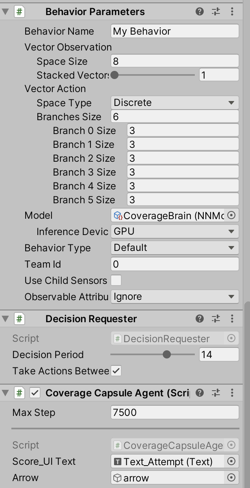

First, install ML-Agents from the [website](https://github.com/Unity-Technologies/ml-agents). (We highly encourage to check basic tutorials to get started with the ML-Agents). Then, download the project folder and open it on Unity Hub. The scene with a capsule agent, a stomach 3D model and the script(CoverageAgent.cs) will be opened. You can see that the trained model (CoverageBrain.nn) is already attached as a component to the capsule. So, you can just run the play mode for the coverage task. In order to train a new model, please follow the steps explained in the ML-Agents' tutorial.

  

