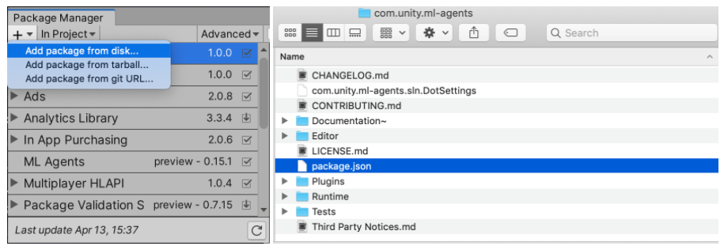

### 1. Installation
First, please make sure that you have the unity version installed higher than 2019.3.2f1. Then install ML-Agents from [here](https://github.com/Unity-Technologies/ml-agents). Please add the package that you have downloaded from ml agents website and give the correct path of the "com.unity.ml-agents" on 5th line in the [manifest.json](Packages/manifest.json) file

  
  
### 2. Reproduce Results

We highly encourage to check basic tutorials to get started with the ML-Agents. After opening the VR-Caps-Unity-RL project open the RL_scene_stomach scene which includes a capsule agent, a stomach 3D model and the script(CoverageAgent.cs). You can see that the trained model (CoverageBrain.nn) is already attached as a component to the capsule. So, you can just run the play mode and it will start scanning the stomach.

  

### 3. Train a new model
In order to train a new model, please follow the instructions provided [here](https://github.com/Unity-Technologies/ml-agents/blob/master/docs/Training-ML-Agents.md) and make necessary adjustments in the behaviour parameters.

